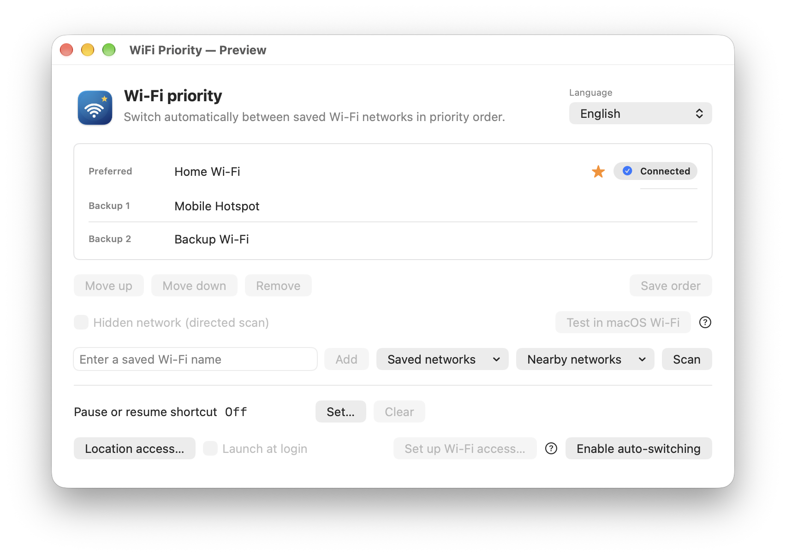
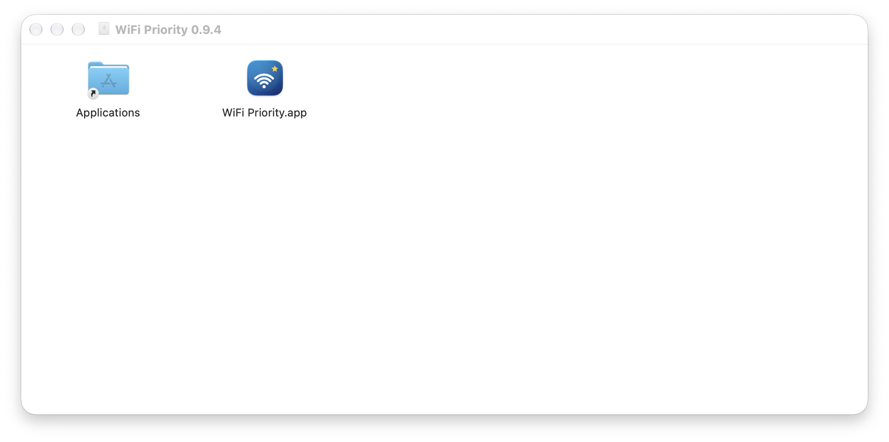

# WiFi Priority

[简体中文说明](README.zh-CN.md)

WiFi Priority is a small macOS menu bar app that switches among your saved Wi-Fi networks in the order you choose.



*Preview with example network names. The badge marks the network currently connected by macOS.*

## Install

1. Download the Apple Silicon DMG from the [v0.9.3 release](https://github.com/xiaohardy/WiFiPriority/releases/tag/v0.9.3).
2. Open the DMG and drag **WiFi Priority** to **Applications**.
3. Open **WiFi Priority** from Applications. The menu bar icon appears at the top of the screen.



This preview build is locally signed but not notarized by Apple. If macOS blocks the first launch, try opening the app once, then go to **System Settings → Privacy & Security → Open Anyway**. [Apple's instructions](https://support.apple.com/en-us/102445) explain this step.

Requires macOS 13 or later on Apple Silicon. The current build was checked on macOS 27; other versions and Intel Macs have not been tested.

## Set up your networks

1. Connect to each network once in macOS Wi-Fi settings so the system saves it.
2. Add those networks in WiFi Priority, put the preferred one first, and save the order. Allow location access when macOS asks; it lets the app read Wi-Fi names.
3. Select **Enable auto-switching**. macOS may ask for Keychain access to each protected network in your list. If a password changes later, use **Refresh saved credentials** in the app.

The app reads credentials only for networks in your list and keeps its authorized copies in your login Keychain. It does not put passwords in settings or logs. Settings and an event log stay on your Mac; the log includes Wi-Fi names, so remove them before sharing it.

You can pause switching from the menu bar or assign an optional keyboard shortcut. To test a network without giving the app its password, pause switching and use **Test in macOS Wi-Fi**. An iPhone Instant Hotspot can be joined through macOS even when it does not appear in a normal Wi-Fi scan; automatic switching can use it only while it is discoverable as a Wi-Fi network.

The stars in the menu bar icon follow your network order. The brighter star shows the connected network, and the icon dims when switching is paused.

## Build from source

Install Xcode or Swift 5.9 or later and Python 3, then run:

```sh
bash scripts/test.sh
bash scripts/build.sh
open "dist/WiFi Priority.app" --args --preview
```

Preview mode uses example networks and does not scan or connect. The default build has an ad hoc signature and is intended for local development.

## Feedback and license

Report bugs or suggest changes in [GitHub Issues](https://github.com/xiaohardy/WiFiPriority/issues). WiFi Priority is released under the [MIT License](LICENSE).
