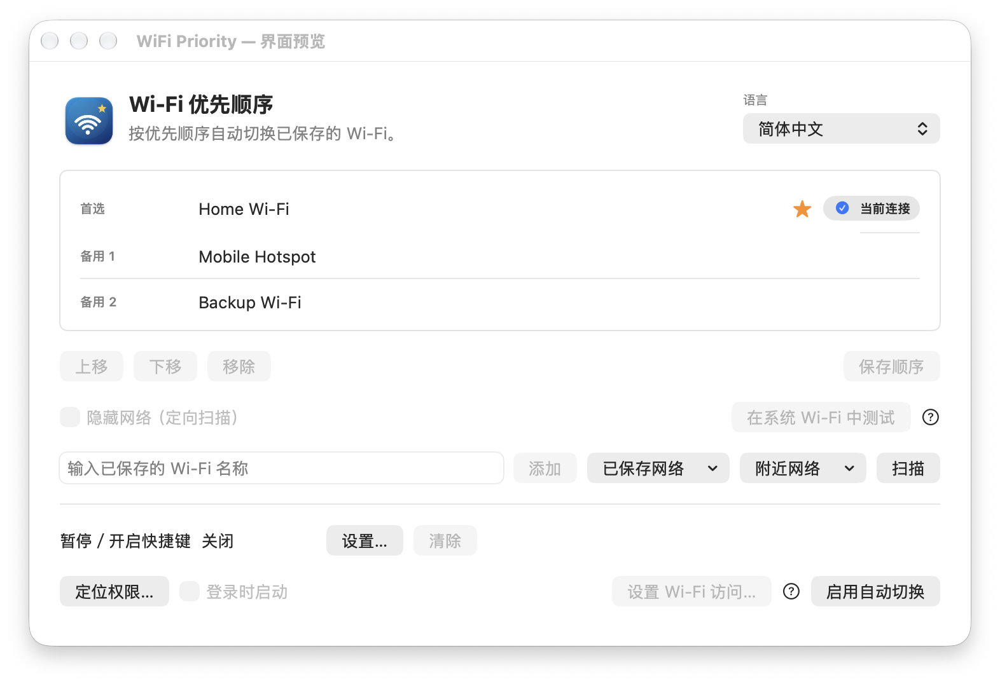

# WiFi Priority｜中文说明

[English](README.md)

给 Wi-Fi 排个队，Mac 就不用在几个已保存的网络之间猜拳了。首选排第一，备用依次往后；哪个正在连接，列表右边会告诉你。

*图中都是虚构网络，放心，你家 Wi-Fi 没上镜。*

## 安装

1. 从 [v0.9.3 预览版](https://github.com/xiaohardy/WiFiPriority/releases/tag/v0.9.3)下载适用于 Apple Silicon 的 DMG。
2. 打开 DMG，把 **WiFi Priority.app** 拖进 **Applications**。
3. 从“应用程序”打开软件；它会待在屏幕顶部的菜单栏。

这个预览版用了本地证书签名，尚未经过 Apple 公证。如果 macOS 阻止首次打开，先尝试打开一次，再到“系统设置 → 隐私与安全性”选择“仍要打开”。操作步骤见 [Apple 官方说明](https://support.apple.com/zh-cn/102445)。目前只在 Apple Silicon、macOS 27 上检查过；最低系统目标为 macOS 13，其他版本和 Intel Mac 尚未实测。

## 排好顺序，开始使用

1. 先在 macOS 的 Wi-Fi 设置中连接并保存要用的网络。软件负责排队，不负责凭空变出密码。
2. 在应用中加入这些网络，把首选放最上面，保存顺序。macOS 询问定位权限时请允许，这是读取当前和附近 Wi-Fi 名称所需。
3. 点击“启用自动切换”。macOS 可能对列表中的加密网络分别询问钥匙串权限；Wi-Fi 密码改过后，可点“更新已保存凭据…”。

应用只读取列表内网络的凭据，获授权的副本保存在你的登录钥匙串，不写入设置或日志。日志会记录 Wi-Fi 名称；分享故障信息前，记得把名称遮一下。

菜单栏的星星按优先顺序站位，亮一点的那颗对应当前网络；暂停后图标会变灰，算是下班了。你也可以设置暂停／开启快捷键，或者干脆不设。手动测试时，先暂停，再选中网络点击“在系统 Wi-Fi 中测试”，由 macOS 完成连接。

iPhone 即时热点有时只在系统 Wi-Fi 里出现，普通扫描找不到它。遇到这种情况可以在系统里手动连接；应用只有在热点作为可发现的 Wi-Fi 网络出现时，才能让它参与自动切换。

## 反馈与许可

发现问题或有改进建议，请到 [GitHub Issues](https://github.com/xiaohardy/WiFiPriority/issues)。源码按 [MIT 许可证](LICENSE)发布；构建方法见 [英文说明](README.md#build-from-source)。
